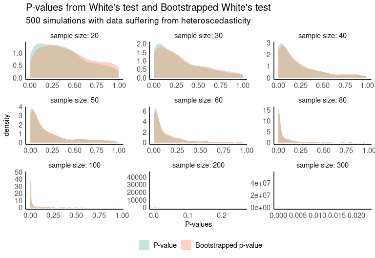
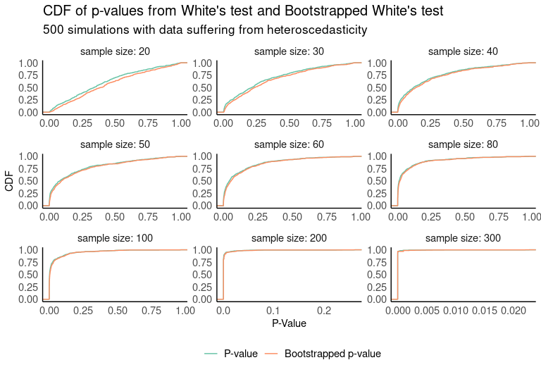

# whitestrap

<!-- badges: start -->

[](https://github.com/jlopezper/whitestrap/actions)
<!-- badges: end -->

The goal of whitestrap is to …

## Installation

You can install the development version from
[GitHub](https://github.com/) with:

``` r
# install.packages("devtools")
devtools::install_github("jlopezper/whitestrap")
```

## Example

This is an example which shows you how you can use the `white_test` and
`white_test_boot` functions:

``` r
library(whitestrap)

set.seed(123)
# Let's simulate some heteroscedastic data
n <- 100
y <- 1:n
sd <- runif(n, min = 0, max = 4)
error <- rnorm(n, 0, sd*y)
X <- y + error
df <- data.frame(y, X)
# OLS model
fit <- lm(y ~ X, data = df)
```

``` r
# White's test and Bootstrapped White's test
white_test(fit)
#> White's test results
#> 
#> Null hypothesis: Homoskedasticity of the residuals
#> Alternative hypothesis: Heteroskedasticity of the residuals
#> Test Statistic: 12.88
#> P-value: 0.001597
white_test_boot(fit)
#> Bootstrapped White's test results
#> 
#> Null hypothesis: Homoskedasticity of the residuals
#> Alternative hypothesis: Heteroskedasticity of the residuals
#> Number of bootstrap samples: 1000
#> Boostrapped Test Statistic: 0.86, 0.04, 0.94, 5.73, 0.5, 2.53, 0.77, 1.93, 0.25, 0.6,...
#> P-value: 0.009
```

In either case, the returned object is a list with the value of the
statistical test and the p-value of the test. For the bootstrapped
version, the number of bootstrap samples is also provided.

``` r
names(white_test(fit))
#> [1] "w_stat"  "p_value"
names(white_test_boot(fit))
#> [1] "w_stat"  "p_value" "iters"
```

You can also see the distribution of the boostrapped test statistics:

``` r
wtest <- white_test_boot(fit)
plot(wtest)
```

<!-- -->

## Comparison between the original and the bootstrap version

One way to compare the results of both tests is through simulations. The
following plot shows the distribution of 500 simulations where the
p-value of both tests is computed. The data used for this purpose were
artificially generated to be heterocedastic, so low p-values are
desirable.

<!-- -->

If we look at the cumulative distribution functions of both p-value
distributions, we see that in small samples the bootstrapped test
returns smaller p-values with higher probability.

<!-- -->

In order to check for differences between the two distributions, a
two-sample Kolmogorov–Smirnov test is run. In this case, we’ll test
whether one distribution stochastically dominates another, so the test
will be run for both alternative sides (*CDF (BW) \> CDF (W)* and *CDF
(BW) \< CDF (W)*). We see from the results that *CDF (BW)* statistically
outperforms *CDF (W)* for samples \< 50. No differences are appreciated
with samples greater than or equal to 50.

<!-- -->
